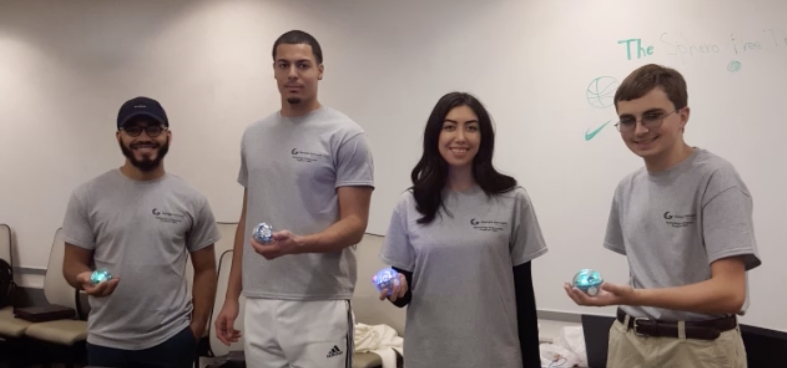

# Using Sphero to Teach Programming Fundamentals 
## About
Our project uses Sphero to teach programming fundamentals (for loops, functions, variables, etc.) in a hands on way. We are 
incorporating basketball as a familiar medium to provide context to programming. The students will navagate the Sphero through the basketball-themed obstacle course only using programming scripts to move the Sphero. TAP is the technology ambassadors program that allows students to learn leadership skills and help promote IT and STEM careers.
## Description
* Difficulty Level: Easy
* Target Audience: Elementary - College
* Needed Materials: A classroom set of Spheros, Sphero EDU app,Sphero EDU website teacher account, small cones, sphero ramp
* Sphero is a small robot ball that moves around by either remote control or code you feed it. 
This workshop is geared towards educating and creating interest in the IT field for non STEM majors. 
By engaging in our workshops, students will get to experiment with Sphero.edu and block coding, which allows them to learn about fundamental programming skills like for loops, functions, variables, etc.
* The Technology Ambassador Program ([TAP](https://www.ggc.edu/academics/school-of-science-and-technology/research-internships-service-learning/technology-ambassador-program)) at GGC strives to break the misconceptions of the IT field by providing fun workshops for students of all backgrounds. TAP students design engaging and fun outreach workshops to encourage interest in IT and STEM.

 

## Team
* Joel Garcia 
* Patrick Page
* Nikki Mehdikhani
* Daniel Redder
### Advisors
* Dr. Cindy Robertson
* Dr. Anca Doloc Mihu  

### Team Photo
  
(Left to Right: Joel Garcia, Patrick Page, Nikki Mehdikhani, Daniel Redder) 

## Publications
1. Joel Garcia, Patrick Page, Nikki Mehdikhani, Daniel Redder, Anca Doloc Mihu, Cindy Robertson. Applying an Interactive Learning Style to Teach Programming Fundamentals Through a Familiar Activity, Consortium for Computing Sciences in Colleges: Southeastern Region (CCSC:SE), October 25th, 2019, Auburn, AL  
2. Joel Garcia, Patrick Page, Nikki Mehdikhani, Daniel Redder, Anca Doloc Mihu, Cindy Robertson. Applying an Interactive Learning Style to Teach Programming Fundamentals Through a Familiar Activity, CREATE Symposium, November 21, 2019, Georgia Gwinnett College

## Outreach Activites 
1. Super Saturday Series(S3), November 9, 2019, GGC – middle and high school girls to promote IT and STEM career   
2. Tap Expo, October 10, 2019, GGC – Promote IT field and the TAP program to college students   
3. Class Workshops – November 12th, November 13th, November 20th, GGC - to promote IT to non-IT college students

## Similar Projects
* [Dancing Sphero](https://github.com/TAP-GGC/DancingSphero)
* [Jedi](https://github.com/TAP-GGC/Jedi)

## Technology
Sphero is a robotic ball that can be programmed in the Sphero EDU app. The Sphero EDU app uses block coding similar to Scratch. 
|  |  |   |
| :-----------------------------------------------------------: | :-----------------------------------------------------------------------------------------------------------------: | :-------------------------------------------------------------: | 
| [Classroom set of Spheros](https://sphero.com/collections/all/products/sphero-bolt-power-pack) | [Sphero Robot](https://sphero.com/collections/all/products/sphero-bolt) | [Sphero EDU website](https://edu.sphero.com/sphero/home) |

# Installation/setup
* A Sphero
* A device (laptop/tablet/phone) with bluetooth connectivity  
* An obstacle course
### Installing Sphero EDU  
For instructions on how to install Sphero EDU please use the pdf file and video linked below.  

### Creating a Teacher Sphero Account 
For instructions on how to create a teacher sphero account please use the pdf file linked below.  

Video 

### Creating a Classroom and Adding Students in Sphero Edu
For instructions on how to create a classroom and add students please use the pdf file linked below.  

Video  

### Creating a Program in Sphero Edu
For instructions on how to create a program please use the pdf file and video linked below.  

# Usage
* Connect the Sphero robot via bluetooth with the device in order to move it. 
* Using the Sphero edu coding enviorment, build a program with block code.
* execute the program to see the Sphero move.
 

